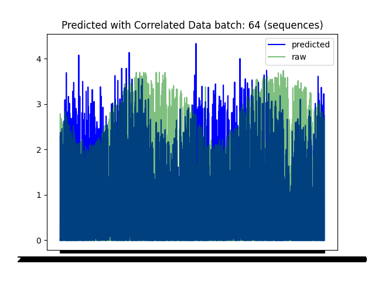
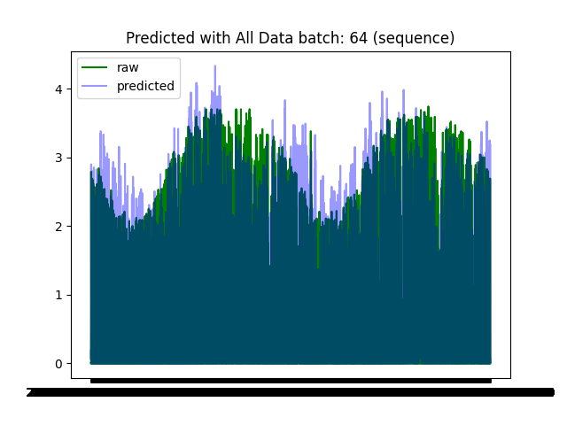

# Solar Radiation Prediction

- author: donghquinn

## DataSet

- Climate ASOS data collected by South Korean Meteorological Administration(KMA)
- Hourly Data Period: 2017-01-01 00:00:00 ~ 2023-10-18 23:00:00

## Methods

### Model

- Input Shape: 48(2 days' data), 12(daily data)
- Long Short-Term memory(LSTM)
- time_steps: 48
- Loss Function: MSE
- Optimaizer: ADAM

### Feature Selection

- Top Attributes selected By Correlations(Pearson)
- All Attributes

### Preprocessing

1. Without Scaling
2. MinMaxScaling: range 0 - 1

### Training

- Compared the results by setting batch size and epoch differently
- validation size: 0.2
- early stopped: monitor val_loss, patient: 5 epochs more

## Conclusion

- Better predicting performance results with all features following evaluation stats(MSE, RMSE)
    - With all attributes: 0.012, 0.000
    - With correlated attributes: 0.016, 0.127

### Visualized Graphs

- Better results using All features with relatively robustic results.

    <h1> Predicted Results With Correlated Variables</h1>
    

    <h1> Predicted Results With All Variables</h1>
    

